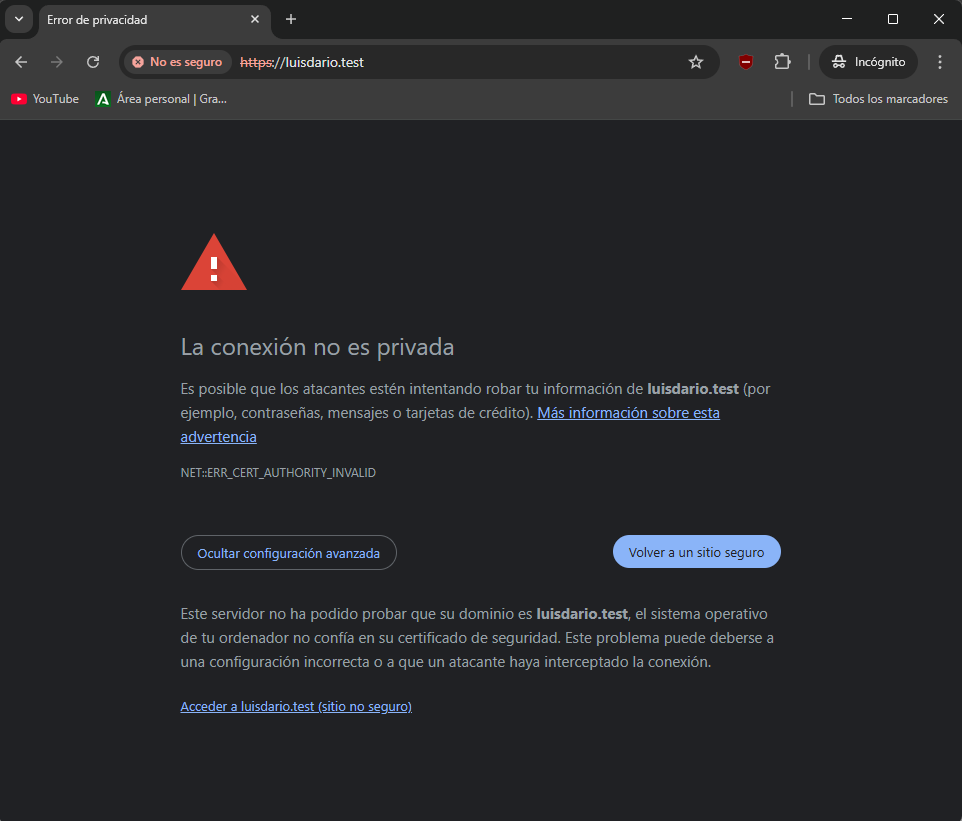
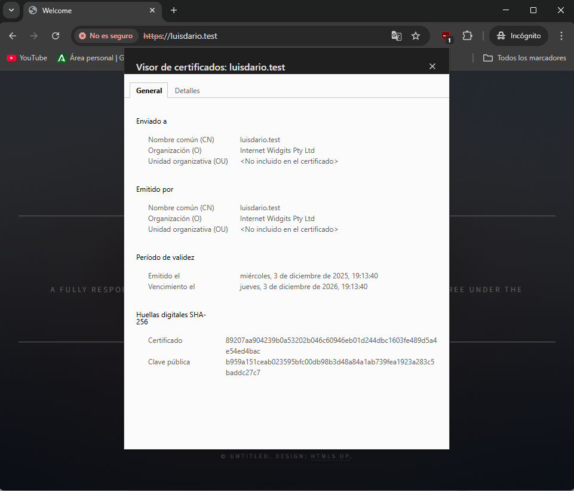

# Práctica 2.3: Acceso seguro con Nginx

## Sumario:

1.  Configuración de Nginx
2.  Configuración del cortafuegos
3.  Generar un certificado autofirmado
4.  Configuración final y activación SSL
5.  Prueba de funcionamiento

## 1. Configuración de Nginx

Lo primero que haremos será editar el fichero de configuración de nuestro sitio:

```
sudo nano /etc/nginx/sites-available/luisdario.test
```

Buscamos la directiva `server_name` y la dejamos así:

```
server_name luisdario.test www.luisdario.test;
```

Una vez modificado, comprobamos que no hemos introducido ningún error de sintaxis y reiniciamos el servicio:

```
sudo nginx -t
sudo systemctl restart nginx
```

## 2. Configuración del cortafuegos

Para asegurar el servidor, vamos a configurar el cortafuegos `ufw`. Si no lo tenemos instalado, lo instalamos:

```
sudo apt install ufw
```

Antes de activarlo, es muy importante permitir la conexión SSH para no perder el acceso a la máquina. Después, activaremos el perfil 'Nginx Full' (que permite tráfico HTTP y HTTPS) y borraremos el perfil antiguo que solo permitía HTTP:

```
sudo ufw allow ssh
sudo ufw allow 'Nginx Full'
sudo ufw delete allow 'Nginx HTTP'
```

Finalmente, habilitamos el cortafuegos y comprobamos el estado:

```
sudo ufw --force enable
sudo ufw status
```

Nos debería salir que el estado es "active" y las reglas están aplicadas correctamente:


## 3. Generar un certificado autofirmado

Vamos a crear la clave SSL y el certificado usando el comando `openssl`. Ejecutamos el siguiente comando:

```
sudo openssl req -x509 -nodes -days 365 -newkey rsa:2048 -keyout /etc/ssl/private/luisdario.test.key -out /etc/ssl/certs/luisdario.test.crt
```

El sistema nos pedirá rellenar algunos datos (País, Provincia, Organización...). Lo más importante es que en el campo Common Name (FQDN) pongamos nuestro nombre de dominio (`luisdario.test`).

## 4. Configuración final y activación SSL

Ahora vamos a añadir a la configuración de nuestro sitio el uso del certificado SSL que acabamos de crear. Volvemos a editar el archivo de configuración:

```
sudo nano /etc/nginx/sites-available/luisdario.test
```

Modificamos el bloque `server` para que escuche en el puerto 443, indicamos las rutas de los certificados y configuramos los protocolos seguros. El archivo debería quedar parecido a esto:

```
server {
    listen 80;
    listen 443 ssl;

    server_name luisdario.test www.luisdario.test;
    root /var/www/luisdario.test/html/static-website-example;
    index index.html index.htm;

    ssl_certificate /etc/ssl/certs/luisdario.test.crt;
    ssl_certificate_key /etc/ssl/private/luisdario.test.key;

    ssl_protocols TLSv1 TLSv1.1 TLSv1.2 TLSv1.3;
    ssl_ciphers HIGH:!aNULL:!MD5;

    location / {
        try_files $uri $uri/ =404;
    }
}
```

Guardamos, comprobamos la configuración de nuevo y reiniciamos el servidor:

```
sudo nginx -t
sudo systemctl restart nginx
```

## 5. Prueba de funcionamiento

Por último, vamos a comprobar que todo funciona. Abrimos el navegador y accedemos a `https://luisdario.test`.

Al ser un certificado autofirmado, el navegador nos dará una advertencia de seguridad, pero si avanzamos, veremos que la conexión está cifrada y que carga nuestra página web correctamente.




