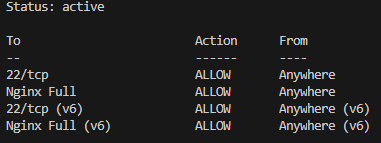

# Práctica 2.3: Acceso seguro con Nginx

## Sumario:

1.  Configuración de Nginx
2.  Configuración del cortafuegos
3.  Generar un certificado autofirmado
4.  Configuración final y activación SSL
5.  Prueba de funcionamiento

## 1. Configuración de Nginx

Lo primero que haremos será editar el fichero de configuración de nuestro sitio:

```
sudo nano /etc/nginx/sites-available/luisdario.test
```

Buscamos la directiva `server_name` y la dejamos así:

```
server_name luisdario.test www.luisdario.test;
```

Una vez modificado, comprobamos que no hemos introducido ningún error de sintaxis y reiniciamos el servicio:

```
sudo nginx -t
sudo systemctl restart nginx
```

## 2. Configuración del cortafuegos

Para asegurar el servidor, vamos a configurar el cortafuegos `ufw`. Si no lo tenemos instalado, lo instalamos:

```
sudo apt install ufw
```

Antes de activarlo, es muy importante permitir la conexión SSH para no perder el acceso a la máquina. Después, activaremos el perfil 'Nginx Full' (que permite tráfico HTTP y HTTPS) y borraremos el perfil antiguo que solo permitía HTTP:

```
sudo ufw allow ssh
sudo ufw allow 'Nginx Full'
sudo ufw delete allow 'Nginx HTTP'
```

Finalmente, habilitamos el cortafuegos y comprobamos el estado:

```
sudo ufw --force enable
sudo ufw status
```

Nos debería salir que el estado es "active" y las reglas están aplicadas correctamente:


